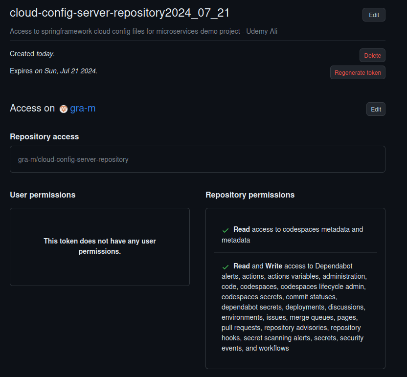

# ReadMe specific for working_containerized_twitter-to-kafka-service branch

This branch was specifically created to isolate a working containerized microservice, before
moving the configuration files.

docker compose up

runs the container along with its required sub-containers:

d075dfa4ec1b   com.microservices.demo/twitter.to.kafka.service:0.0.1-SNAPSHOT 
fa01761437c7   confluentinc/cp-schema-registry:5.0.4                           
506c32ce2bde   confluentinc/cp-kafka:5.0.4                                    
10b9d349a5c8   confluentinc/cp-kafka:5.0.4                                     
eec84210d4b6   confluentinc/cp-kafka:5.0.4                                      
92c0e75f933a   confluentinc/cp-zookeeper:5.0.4  

but one of the brokers or e.g. schema registry fails and inevitably needs to be restarted.

For this reason it is suggested that docker desktop or intellij docker service is used to 
quickly restart failed docker processes.

it then works:

